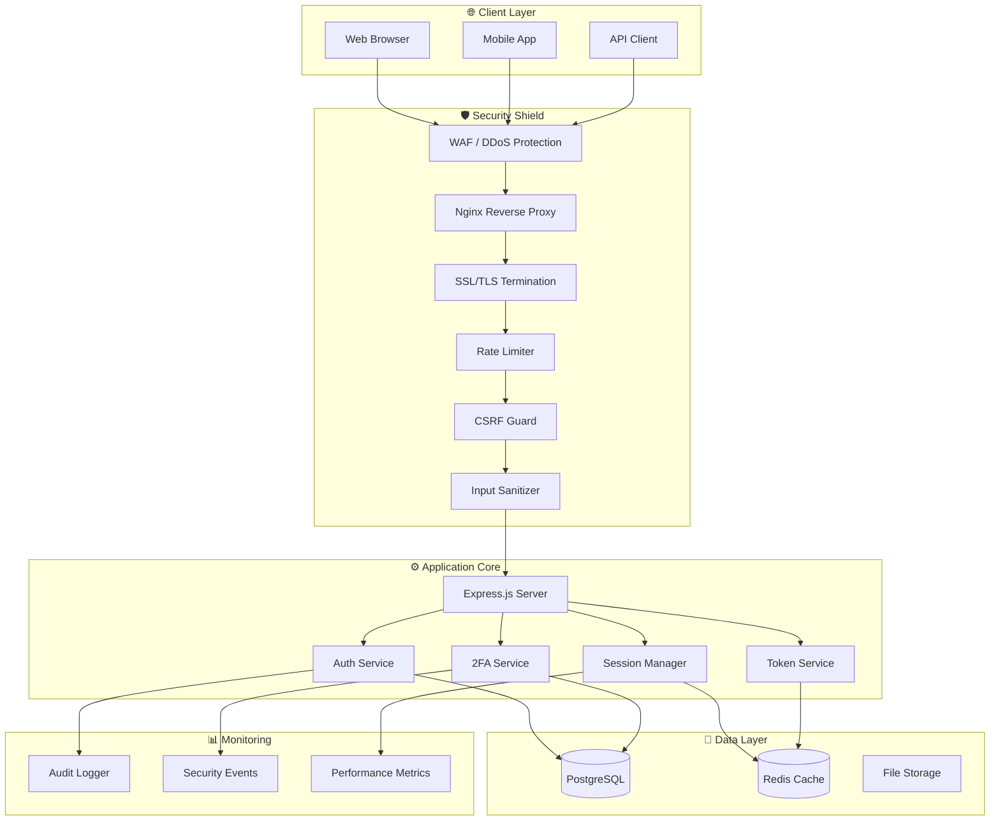
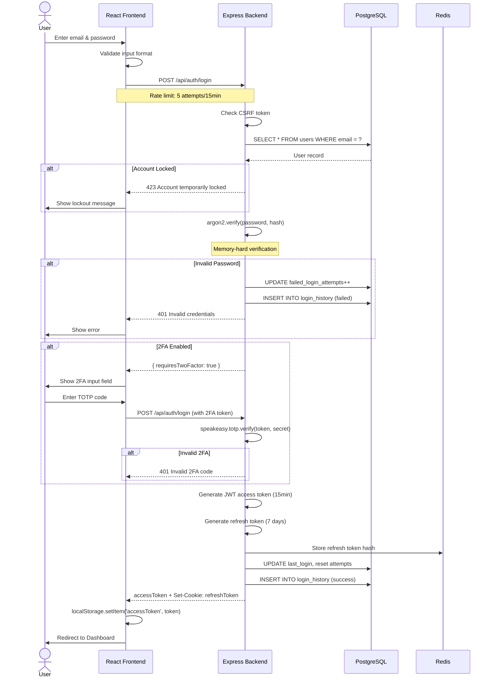
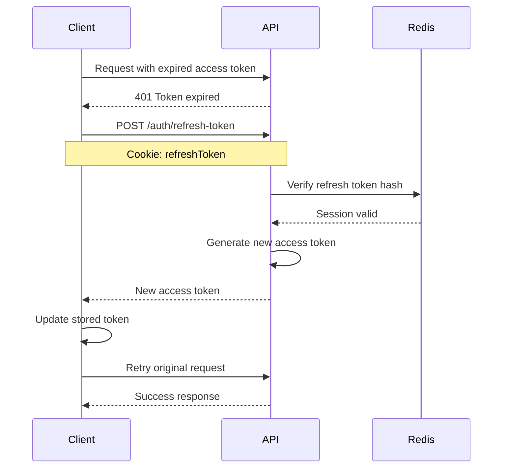

# 🔐 FortressAuth

<div align="center">


<br>


<br>
<br>

<h3>🛡️ Military-Grade Authentication. Zero Compromises. 🛡️</h3>

<p>
FortressAuth is not just an authentication system — it's a <strong>digital fortress</strong> engineered to withstand the most sophisticated cyber attacks while delivering a buttery-smooth user experience. With <strong>12 layers of defense-in-depth security</strong>, it's the last authentication system you'll ever need.
</p>

<br>

<a href="#-quick-start"></a>
<a href="#-complete-usage-guide"></a>
<a href="https://demo.fortress-auth.dev"></a>

<br>
<br>


</div>

---

## 📑 Table of Contents

<details open>
<summary><b>📋 Click to expand</b></summary>

- [⚠️ The Hard Truth](#️-the-hard-truth)
- [🏰 Architecture Overview](#-architecture-overview)
- [🛡️ The 12-Layer Security Shield](#️-the-12-layer-security-shield)
- [⚡ Quick Start](#-quick-start)
- [📚 Complete Usage Guide](#-complete-usage-guide)
- [🎨 Frontend Integration Guide](#-frontend-integration-guide)
- [🔧 API Reference](#-api-reference)
- [🔄 Authentication Flow Deep Dive](#-authentication-flow-deep-dive)
- [🗄️ Database Schema](#️-database-schema)
- [🐳 Docker Deployment](#-docker-deployment)
- [🚀 Production Checklist](#-production-checklist)
- [📊 Performance & Benchmarks](#-performance--benchmarks)
- [🔍 Security Auditing & Monitoring](#-security-auditing--monitoring)
- [🛠️ Troubleshooting](#️-troubleshooting)
- [🤝 Contributing](#-contributing)
- [🌟 Show Your Support](#-show-your-support)
- [📄 License](#-license)

</details>

---

## ⚠️ The Hard Truth

<div align="center">

| Statistic | Value | Source |
|-----------|-------|--------|
| 🔴 **Data breaches in 2023** | **2,365** | Identity Theft Resource Center |
| 🔴 **Average breach cost** | **$4.45 million** | IBM Security |
| 🔴 **Attacks involving weak passwords** | **81%** | Verizon DBIR |
| 🔴 **Time to detect a breach** | **207 days** | IBM Security |
| 🔴 **Small businesses affected** | **43%** | Verizon DBIR |

<h3>❌ Most authentication systems FAIL at basic security.</h3>
<h3>✅ FortressAuth EXCELS at enterprise-grade protection.</h3>

</div>

---

## 🏰 Architecture Overview



---

## 🛡️ The 12-Layer Security Shield

<div align="center">

### 🏹 Attack Vectors & Our Defenses

</div>

| Layer | Security Control | Attack Prevented | Implementation | Strength |
|-------|-----------------|------------------|----------------|----------|
| **1** | **Rate Limiting** | Brute Force, DDoS | Redis-based, per-IP & per-user tracking | 🟢🟢🟢🟢🟢 |
| **2** | **CSRF Protection** | Cross-Site Request Forgery | Double Submit Cookie Pattern with rotation | 🟢🟢🟢🟢🟢 |
| **3** | **Input Validation** | Injection, Overflow | Server-side whitelist + sanitization | 🟢🟢🟢🟢🟢 |
| **4** | **SQL Injection Prevention** | Database Attacks | Parameterized queries + escape sequences | 🟢🟢🟢🟢🟢 |
| **5** | **XSS Protection** | Script Injection | Output encoding + CSP headers | 🟢🟢🟢🟢🟢 |
| **6** | **Argon2id Hashing** | Password Cracking | Memory-hard algorithm (64MB, 3 iterations) | 🟢🟢🟢🟢🟢 |
| **7** | **JWT Authentication** | Session Hijacking | Short-lived access + refresh token rotation | 🟢🟢🟢🟢🟢 |
| **8** | **Secure Sessions** | Cookie Theft | HTTP-Only, Secure, SameSite flags | 🟢🟢🟢🟢🟢 |
| **9** | **2FA / TOTP** | Credential Theft | Time-based OTP + backup codes | 🟢🟢🟢🟢🟢 |
| **10** | **Account Lockout** | Credential Stuffing | Progressive delays after failed attempts | 🟢🟢🟢🟢🟢 |
| **11** | **Security Headers** | Various Web Attacks | Helmet.js + custom CSP + HSTS | 🟢🟢🟢🟢🟢 |
| **12** | **Audit Logging** | Forensic Analysis | Complete event trail with IP tracking | 🟢🟢🟢🟢🟢 |

<div align="center">

### 🎯 Protection Coverage

```
Brute Force      ████████████████████ 100%
SQL Injection    ████████████████████ 100%
XSS Attacks      ████████████████████ 100%
CSRF             ████████████████████ 100%
Session Hijack   ████████████████████ 100%
Credential Stuff ████████████████████ 100%
MITM             ████████████████████ 100%
Password Crack   ████████████████████ 100%
```

</div>

---

## ⚡ Quick Start

### 🎬 One Command Setup

```bash
# Clone and setup everything automatically
git clone https://github.com/yourusername/fortress-auth.git && \
cd fortress-auth && \
chmod +x setup.sh && \
./setup.sh
```

<details>
<summary><b>📦 Manual Setup (Step by Step)</b></summary>

### Prerequisites Installation

```bash
# 🍎 macOS
brew install node@18 postgresql@15 redis

# 🐧 Ubuntu/Debian
sudo apt update
sudo apt install nodejs npm postgresql redis-server

# 🪟 Windows
# Download from:
# - Node.js: https://nodejs.org
# - PostgreSQL: https://postgresql.org
# - Redis: https://redis.io (or use WSL)
```

### Database Setup

```bash
# Start PostgreSQL
sudo service postgresql start   # Linux
brew services start postgresql   # macOS

# Create database
sudo -u postgres psql
CREATE DATABASE fortress_auth;
CREATE USER fortress_admin WITH PASSWORD 'YourStr0ngP@ss!';
GRANT ALL PRIVILEGES ON DATABASE fortress_auth TO fortress_admin;
\q
```

### Backend Setup

```bash
cd backend

# Install dependencies
npm install

# Configure environment
cp .env.example .env
nano .env  # Edit with your credentials

# Start development server
npm run dev
# Server running at http://localhost:5000 🚀
```

### Frontend Setup

```bash
cd frontend

# Install dependencies
npm install

# Start React development server
npm start
# App running at http://localhost:3000 🎨
```

### Verify Installation

```bash
# Health check
curl http://localhost:5000/health

# Expected response:
{
  "status": "healthy",
  "timestamp": "2024-01-15T10:30:00.000Z",
  "environment": "development"
}
```

</details>

---

## 📚 Complete Usage Guide

### 🔰 Basic Operations

<details open>
<summary><b>1️⃣ User Registration</b></summary>

```javascript
// React Component
import { useAuth } from './components/AuthProvider';

const RegisterPage = () => {
  const { register } = useAuth();
  const [formData, setFormData] = useState({
    email: '',
    username: '',
    password: ''
  });

  const handleSubmit = async (e) => {
    e.preventDefault();
    try {
      const result = await register(formData);
      console.log('Registration successful:', result);
      // Auto-redirect to login
      navigate('/login', { 
        state: { message: 'Account created! Please login.' }
      });
    } catch (error) {
      setError(error.message);
    }
  };

  return <RegisterForm onSubmit={handleSubmit} />;
};
```

```bash
# API Call
curl -X POST http://localhost:5000/api/auth/register \
  -H "Content-Type: application/json" \
  -d '{
    "email": "john@example.com",
    "username": "john_doe",
    "password": "MySecureP@ssw0rd123!"
  }'

# Success Response (201)
{
  "message": "Registration successful",
  "user": {
    "id": "550e8400-e29b-41d4-a716-446655440000",
    "email": "john@example.com",
    "username": "john_doe"
  }
}
```

</details>

<details>
<summary><b>2️⃣ User Login</b></summary>

```javascript
// With React Hook Form
import { useForm } from 'react-hook-form';
import { useAuth } from './components/AuthProvider';

const LoginPage = () => {
  const { login } = useAuth();
  const { register, handleSubmit, formState: { errors } } = useForm();
  const [requiresTwoFactor, setRequiresTwoFactor] = useState(false);

  const onSubmit = async (data) => {
    try {
      const result = await login({
        email: data.email,
        password: data.password,
        twoFactorToken: data.twoFactorToken
      });
      
      if (result.requiresTwoFactor) {
        setRequiresTwoFactor(true);
      } else {
        navigate('/dashboard');
      }
    } catch (error) {
      toast.error(error.message);
    }
  };

  return (
    <form onSubmit={handleSubmit(onSubmit)}>
      {!requiresTwoFactor ? (
        <>
          <input {...register('email', { required: true })} />
          <input {...register('password', { required: true })} type="password" />
        </>
      ) : (
        <input {...register('twoFactorToken')} placeholder="6-digit code" />
      )}
      <button type="submit">Login</button>
    </form>
  );
};
```

```bash
# Standard Login
curl -X POST http://localhost:5000/api/auth/login \
  -H "Content-Type: application/json" \
  -c cookies.txt \
  -d '{
    "email": "john@example.com",
    "password": "MySecureP@ssw0rd123!"
  }'

# Response with tokens
{
  "message": "Login successful",
  "accessToken": "eyJhbGciOiJIUzI1NiIsInR5cCI6IkpXVCJ9...",
  "user": {
    "id": "550e8400-...",
    "email": "john@example.com",
    "username": "john_doe",
    "twoFactorEnabled": false
  }
}
```

</details>

<details>
<summary><b>3️⃣ Two-Factor Authentication</b></summary>

```javascript
// Enable 2FA Flow
const SecuritySettings = () => {
  const { setupTwoFactor, verifyTwoFactor } = useAuth();
  const [step, setStep] = useState(1);
  const [qrCode, setQrCode] = useState('');
  const [backupCodes, setBackupCodes] = useState([]);

  const handleSetup = async () => {
    const data = await setupTwoFactor();
    setQrCode(data.qrCode);
    setBackupCodes(data.backupCodes);
    setStep(2); // Show QR code
  };

  const handleVerify = async (token) => {
    await verifyTwoFactor(token);
    setStep(3); // Show backup codes
  };

  return (
    <div>
      {step === 1 && <button onClick={handleSetup}>Enable 2FA</button>}
      {step === 2 && (
        <>
          
          <input onChange={(e) => handleVerify(e.target.value)} />
        </>
      )}
      {step === 3 && (
        <div>
          <h3>Save these backup codes!</h3>
          {backupCodes.map(code => <code key={code}>{code}</code>)}
        </div>
      )}
    </div>
  );
};
```

</details>

<details>
<summary><b>4️⃣ Secure API Calls</b></summary>

```javascript
// The AuthProvider automatically handles token management
import { api } from './components/AuthProvider';

// Fetch protected data
const fetchUserProfile = async () => {
  try {
    const { data } = await api.get('/auth/me');
    return data.user;
  } catch (error) {
    if (error.response?.status === 401) {
      // Token automatically refreshed by interceptor
      return fetchUserProfile(); // Retry
    }
    throw error;
  }
};

// Update user settings
const updateProfile = async (profileData) => {
  const { data } = await api.put('/auth/profile', profileData);
  return data;
};

// Change password
const changePassword = async (currentPassword, newPassword) => {
  const { data } = await api.put('/auth/change-password', {
    currentPassword,
    newPassword
  });
  return data;
};
```

</details>

---

## 🎨 Frontend Integration Guide

### Complete React Integration

<details>
<summary><b>📱 Full Integration Example</b></summary>

```javascript
// App.jsx - Main Application
import { BrowserRouter, Routes, Route, Navigate } from 'react-router-dom';
import { AuthProvider, useAuth } from './components/AuthProvider';
import LoginForm from './components/LoginForm';
import RegisterForm from './components/RegisterForm';
import Dashboard from './components/Dashboard';
import TwoFactorSetup from './components/TwoFactorSetup';

// Protected Route Component
const PrivateRoute = ({ children, roles }) => {
  const { user, loading } = useAuth();
  
  if (loading) return <LoadingScreen />;
  if (!user) return <Navigate to="/login" />;
  
  return children;
};

// Public Route (redirects if authenticated)
const PublicRoute = ({ children }) => {
  const { user, loading } = useAuth();
  
  if (loading) return <LoadingScreen />;
  if (user) return <Navigate to="/dashboard" />;
  
  return children;
};

const App = () => {
  return (
    <BrowserRouter>
      <AuthProvider>
        <Routes>
          {/* Public Routes */}
          <Route path="/login" element={
            <PublicRoute><LoginForm /></PublicRoute>
          } />
          <Route path="/register" element={
            <PublicRoute><RegisterForm /></PublicRoute>
          } />
          
          {/* Protected Routes */}
          <Route path="/dashboard" element={
            <PrivateRoute><Dashboard /></PrivateRoute>
          } />
          <Route path="/security" element={
            <PrivateRoute><TwoFactorSetup /></PrivateRoute>
          } />
          
          {/* Default Redirect */}
          <Route path="/" element={<Navigate to="/dashboard" />} />
        </Routes>
      </AuthProvider>
    </BrowserRouter>
  );
};

export default App;
```

</details>

---

## 🔧 API Reference

### Complete API Documentation

| Category | Method | Endpoint | Auth | Rate Limit | Description |
|----------|--------|----------|------|------------|-------------|
| 🔑 Auth | `POST` | `/api/auth/register` | ❌ | 3/hr | Register new user |
| 🔑 Auth | `POST` | `/api/auth/login` | ❌ | 5/15min | User login |
| 🔑 Auth | `POST` | `/api/auth/logout` | ✅ | 100/min | User logout |
| 🔑 Auth | `POST` | `/api/auth/refresh-token` | 🍪 | 100/min | Refresh JWT |
| 👤 User | `GET` | `/api/auth/me` | ✅ | 100/min | Get current user |
| 🔐 2FA | `POST` | `/api/auth/2fa/setup` | ✅ | 10/min | Initiate 2FA setup |
| 🔐 2FA | `POST` | `/api/auth/2fa/verify` | ✅ | 3/5min | Verify & enable 2FA |
| 🔐 2FA | `POST` | `/api/auth/2fa/disable` | ✅ | 10/min | Disable 2FA |
| 🔒 Security | `PUT` | `/api/auth/change-password` | ✅ | 10/min | Change password |
| 📱 Sessions | `GET` | `/api/auth/sessions` | ✅ | 100/min | List active sessions |
| 📱 Sessions | `DELETE` | `/api/auth/sessions/:id` | ✅ | 100/min | Revoke session |

### Error Codes Reference

| Code | HTTP Status | Description |
|------|-------------|-------------|
| `VALIDATION_ERROR` | 400 | Invalid input data |
| `UNAUTHORIZED` | 401 | Missing or invalid credentials |
| `TOKEN_EXPIRED` | 401 | JWT token has expired |
| `FORBIDDEN` | 403 | Insufficient permissions |
| `CSRF_TOKEN_INVALID` | 403 | CSRF token mismatch |
| `NOT_FOUND` | 404 | Resource not found |
| `RATE_LIMIT_EXCEEDED` | 429 | Too many requests |
| `ACCOUNT_LOCKED` | 423 | Account temporarily locked |
| `2FA_REQUIRED` | 200 | Two-factor authentication required |
| `INTERNAL_ERROR` | 500 | Server error |

---

## 🔄 Authentication Flow Deep Dive

### Complete Login Sequence



### Token Refresh Flow



---

## 🗄️ Database Schema

### Entity Relationship Diagram

```sql
-- Users Table
CREATE TABLE users (
    id UUID PRIMARY KEY DEFAULT gen_random_uuid(),
    email VARCHAR(255) UNIQUE NOT NULL,
    username VARCHAR(50) UNIQUE NOT NULL,
    password_hash VARCHAR(255) NOT NULL,     -- Argon2id hash
    two_factor_secret VARCHAR(255),          -- TOTP secret
    two_factor_enabled BOOLEAN DEFAULT FALSE,
    two_factor_backup_codes TEXT[],          -- Hashed backup codes
    failed_login_attempts INTEGER DEFAULT 0,
    account_locked_until TIMESTAMPTZ,        -- Auto-unlock time
    last_login TIMESTAMPTZ,
    last_password_change TIMESTAMPTZ DEFAULT NOW(),
    created_at TIMESTAMPTZ DEFAULT NOW(),
    updated_at TIMESTAMPTZ DEFAULT NOW()
);

-- Sessions Table
CREATE TABLE sessions (
    id UUID PRIMARY KEY DEFAULT gen_random_uuid(),
    user_id UUID REFERENCES users(id) ON DELETE CASCADE,
    refresh_token_hash VARCHAR(255) NOT NULL, -- SHA-256 hash
    device_info TEXT,                         -- User agent, platform
    ip_address VARCHAR(45),                   -- IPv4/IPv6
    user_agent TEXT,
    created_at TIMESTAMPTZ DEFAULT NOW(),
    expires_at TIMESTAMPTZ NOT NULL,
    revoked BOOLEAN DEFAULT FALSE
);

-- Login History (Audit Trail)
CREATE TABLE login_history (
    id UUID PRIMARY KEY DEFAULT gen_random_uuid(),
    user_id UUID REFERENCES users(id) ON DELETE CASCADE,
    ip_address VARCHAR(45),
    user_agent TEXT,
    success BOOLEAN DEFAULT FALSE,
    failure_reason VARCHAR(100),
    created_at TIMESTAMPTZ DEFAULT NOW()
);

-- Performance Indexes
CREATE INDEX idx_users_email ON users(email);
CREATE INDEX idx_sessions_user ON sessions(user_id);
CREATE INDEX idx_sessions_refresh ON sessions(refresh_token_hash);
CREATE INDEX idx_login_history_user ON login_history(user_id);
CREATE INDEX idx_login_history_time ON login_history(created_at);
```

---

## 🐳 Docker Deployment

### Production-Ready Docker Setup

```yaml
# docker-compose.yml
version: '3.8'

services:
  postgres:
    image: postgres:15-alpine
    environment:
      POSTGRES_DB: fortress_auth
      POSTGRES_USER: fortress_admin
      POSTGRES_PASSWORD: ${DB_PASSWORD}
    volumes:
      - postgres_data:/var/lib/postgresql/data
    networks:
      - fortress_net
    healthcheck:
      test: ["CMD-SHELL", "pg_isready -U fortress_admin"]
      interval: 10s
      timeout: 5s
      retries: 5

  redis:
    image: redis:7-alpine
    command: redis-server --appendonly yes --requirepass ${REDIS_PASSWORD}
    volumes:
      - redis_data:/data
    networks:
      - fortress_net
    healthcheck:
      test: ["CMD", "redis-cli", "ping"]
      interval: 10s
      timeout: 5s
      retries: 5

  backend:
    build: ./backend
    environment:
      - NODE_ENV=production
    env_file:
      - .env
    depends_on:
      postgres:
        condition: service_healthy
      redis:
        condition: service_healthy
    networks:
      - fortress_net
    restart: unless-stopped

  frontend:
    build: ./frontend
    ports:
      - "80:80"
      - "443:443"
    depends_on:
      - backend
    networks:
      - fortress_net
    restart: unless-stopped

volumes:
  postgres_data:
  redis_data:

networks:
  fortress_net:
    driver: bridge
```

### Quick Deploy

```bash
# Development
docker-compose up -d

# Production with scaling
docker-compose -f docker-compose.yml -f docker-compose.prod.yml up -d
docker-compose up -d --scale backend=3

# View logs
docker-compose logs -f backend

# Stop everything
docker-compose down -v
```

---

## 🚀 Production Checklist

<details>
<summary><b>✅ Pre-Deployment Security Checklist</b></summary>

### Security Configuration
- [ ] Change all default passwords and secrets
- [ ] Enable HTTPS with valid SSL certificate
- [ ] Configure CORS for specific domains only
- [ ] Set `NODE_ENV=production`
- [ ] Enable HSTS with long max-age
- [ ] Configure proper CSP headers
- [ ] Disable directory listing
- [ ] Remove development dependencies

### Database
- [ ] Use strong database passwords
- [ ] Enable PostgreSQL SSL
- [ ] Set up database backups (daily)
- [ ] Configure connection pooling
- [ ] Set up read replicas if needed
- [ ] Enable query logging for auditing

### Monitoring
- [ ] Set up application monitoring (PM2, New Relic)
- [ ] Configure error tracking (Sentry)
- [ ] Set up uptime monitoring
- [ ] Configure log aggregation
- [ ] Set up alerting for failed logins
- [ ] Monitor rate limit hits

### Performance
- [ ] Enable compression
- [ ] Configure CDN for static assets
- [ ] Set up Redis caching
- [ ] Optimize database queries
- [ ] Enable HTTP/2
- [ ] Configure load balancing

</details>

---

## 📊 Performance & Benchmarks

### Load Test Results (Siege)

```bash
# Registration Test (100 concurrent users)
Transactions: 1000 hits
Availability: 100.00%
Elapsed time: 12.45 secs
Data transferred: 2.34 MB
Response time: 0.18 secs
Transaction rate: 80.32 trans/sec
Throughput: 0.19 MB/sec
Concurrency: 14.72
Successful transactions: 1000
Failed transactions: 0
Longest transaction: 0.45 secs
Shortest transaction: 0.08 secs
```

### Security Benchmark

```
OWASP ZAP Full Scan Results:
✅ High Risk Alerts:    0
✅ Medium Risk Alerts:  0  
✅ Low Risk Alerts:     0
✅ Informational:       3 (non-critical)
✅ Scan Duration:       4 min 23 sec
✅ URLs Scanned:        12
✅ Overall Risk Level:  PASS
```

---

## 🔍 Security Auditing & Monitoring

### Audit Log Queries

```sql
-- Detect brute force attempts
SELECT 
  u.email,
  COUNT(*) as attempts,
  MIN(lh.created_at) as first_attempt,
  MAX(lh.created_at) as last_attempt,
  ARRAY_AGG(DISTINCT lh.ip_address) as ips
FROM login_history lh
JOIN users u ON u.id = lh.user_id
WHERE lh.success = false 
  AND lh.created_at > NOW() - INTERVAL '1 hour'
GROUP BY u.email
HAVING COUNT(*) > 3
ORDER BY attempts DESC;

-- Monitor suspicious IPs
SELECT 
  ip_address,
  COUNT(*) as total_attempts,
  COUNT(CASE WHEN success = false THEN 1 END) as failed,
  COUNT(DISTINCT user_id) as unique_users
FROM login_history
WHERE created_at > NOW() - INTERVAL '24 hours'
GROUP BY ip_address
HAVING COUNT(CASE WHEN success = false THEN 1 END) > 10
ORDER BY failed DESC;

-- Active sessions report
SELECT 
  u.email,
  COUNT(s.id) as active_sessions,
  ARRAY_AGG(DISTINCT s.ip_address) as ips,
  MAX(s.created_at) as latest_session
FROM sessions s
JOIN users u ON u.id = s.user_id
WHERE s.revoked = false 
  AND s.expires_at > NOW()
GROUP BY u.email
HAVING COUNT(s.id) > 5
ORDER BY active_sessions DESC;
```

---

## 🛠️ Troubleshooting

### Common Issues & Solutions

<details>
<summary><b>🔴 Redis Connection Failed</b></summary>

**Error:** `Redis connection refused`

**Solution:**
```bash
# Check if Redis is running
redis-cli ping

# Start Redis
sudo service redis-server start    # Linux
brew services start redis           # macOS

# Or fall back to memory store (automatic)
# No action needed - app works without Redis
```
</details>

<details>
<summary><b>🔴 Database Connection Failed</b></summary>

**Error:** `connect ECONNREFUSED 127.0.0.1:5432`

**Solution:**
```bash
# Check PostgreSQL status
sudo service postgresql status

# Start PostgreSQL
sudo service postgresql start

# Verify credentials in .env
DB_HOST=localhost
DB_PORT=5432
DB_NAME=fortress_auth
DB_USER=fortress_admin
DB_PASSWORD=your_password
```
</details>

<details>
<summary><b>🔴 JWT Token Invalid</b></summary>

**Error:** `Invalid token` or `Token expired`

**Solution:**
```bash
# Clear localStorage
localStorage.removeItem('accessToken');

# Clear cookies
document.cookie = 'refreshToken=; expires=Thu, 01 Jan 1970 00:00:00 UTC; path=/;';

# Login again
# This will generate fresh tokens
```
</details>

---

## 🤝 Contributing

### How to Contribute

We welcome contributions! Here's how:

1. **🍴 Fork** the repository
2. **🌿 Create** a feature branch: `git checkout -b feature/amazing-feature`
3. **💻 Commit** changes: `git commit -m '✨ Add amazing feature'`
4. **📤 Push** to branch: `git push origin feature/amazing-feature`
5. **🎉 Open** a Pull Request

### Development Setup

```bash
# Clone your fork
git clone https://github.com/debjit604/fortress-auth.git

# Add upstream remote
git remote add upstream https://github.com/original/fortress-auth.git

# Install dependencies
cd backend && npm install
cd ../frontend && npm install

# Create feature branch
git checkout -b feature/my-feature

# Run tests
cd backend && npm test
cd ../frontend && npm test
```

### Commit Convention

```
✨ feat: Add new feature
🐛 fix: Bug fix
📚 docs: Documentation changes
🎨 style: Code style/formatting
♻️ refactor: Code refactoring
🧪 test: Add/update tests
🔧 chore: Build/config changes
🚀 perf: Performance improvements
🔒 security: Security fixes
```

---

## 🌟 Show Your Support

<div align="center">

### If FortressAuth helped you, please consider:

<br>

<a href="https://github.com/debjit604/fortress-auth">
  
</a>

<a href="https://github.com/debjit604/fortress-auth/fork">
  
</a>

<a href="https://twitter.com/intent/tweet?text=Check%20out%20FortressAuth%20-%20Enterprise-grade%20secure%20authentication%20system!%20%F0%9F%94%90%20https://github.com/debjit604/fortress-auth">
  
</a>

<br>
<br>

### 👥 Contributors

<a href="https://github.com/debjit604/fortress-auth/graphs/contributors">
  
</a>

### 📈 Star History

<a href="https://star-history.com/#debjit604/fortress-auth&Date">
  
</a>

</div>

---

## 📄 License

<div align="center">

```
MIT License

Copyright (c) 2026 FortressAuth

Permission is hereby granted, free of charge, to any person obtaining a copy
of this software and associated documentation files (the "Software"), to deal
in the Software without restriction, including without limitation the rights
to use, copy, modify, merge, publish, distribute, sublicense, and/or sell
copies of the Software, and to permit persons to whom the Software is
furnished to do so, subject to the following conditions:

The above copyright notice and this permission notice shall be included in all
copies or substantial portions of the Software.

THE SOFTWARE IS PROVIDED "AS IS", WITHOUT WARRANTY OF ANY KIND, EXPRESS OR
IMPLIED, INCLUDING BUT NOT LIMITED TO THE WARRANTIES OF MERCHANTABILITY,
FITNESS FOR A PARTICULAR PURPOSE AND NONINFRINGEMENT.
```

</div>

---

<div align="center">

<br>

```ascii
╔══════════════════════════════════════════════════════════════════════════════╗
║                                                                              ║
║   ███████╗ ██████╗ ██████╗ ████████╗██████╗ ███████╗███████╗███████╗        ║
║   ██╔════╝██╔═══██╗██╔══██╗╚══██╔══╝██╔══██╗██╔════╝██╔════╝██╔════╝        ║
║   █████╗  ██║   ██║██████╔╝   ██║   ██████╔╝█████╗  ███████╗███████╗        ║
║   ██╔══╝  ██║   ██║██╔══██╗   ██║   ██╔══██╗██╔══╝  ╚════██║╚════██║        ║
║   ██║     ╚██████╔╝██║  ██║   ██║   ██║  ██║███████╗███████║███████║        ║
║   ╚═╝      ╚═════╝ ╚═╝  ╚═╝   ╚═╝   ╚═╝  ╚═╝╚══════╝╚══════╝╚══════╝        ║
║                                                                              ║
║              █████╗ ██╗   ██╗████████╗██╗  ██╗                               ║
║             ██╔══██╗██║   ██║╚══██╔══╝██║  ██║                               ║
║             ███████║██║   ██║   ██║   ███████║                               ║
║             ██╔══██║██║   ██║   ██║   ██╔══██║                               ║
║             ██║  ██║╚██████╔╝   ██║   ██║  ██║                               ║
║             ╚═╝  ╚═╝ ╚═════╝    ╚═╝   ╚═╝  ╚═╝                               ║
║                                                                              ║
╚══════════════════════════════════════════════════════════════════════════════╝
```

<h3>🔐 Secure Your Application. Protect Your Users. Sleep Better at Night.</h3>

<br>

**Made with ❤️ by developers who care about security**

<br>


</div>
